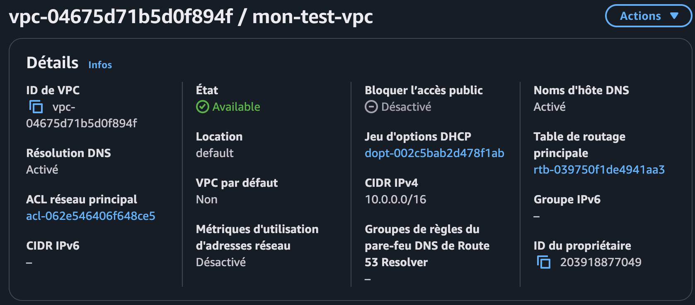
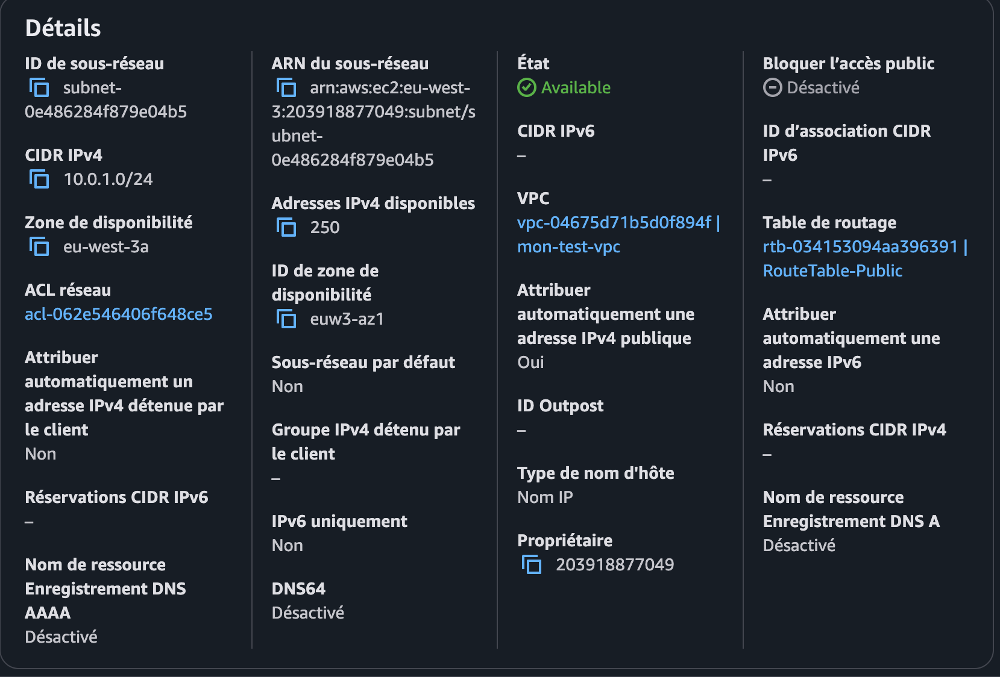
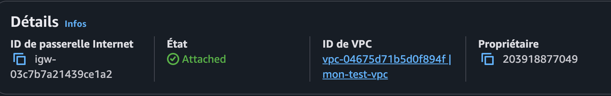
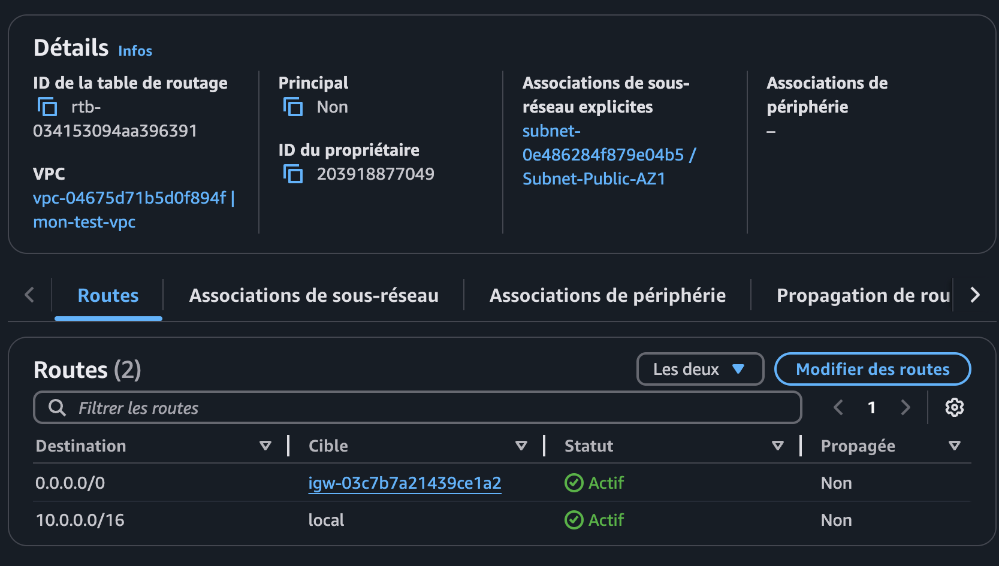
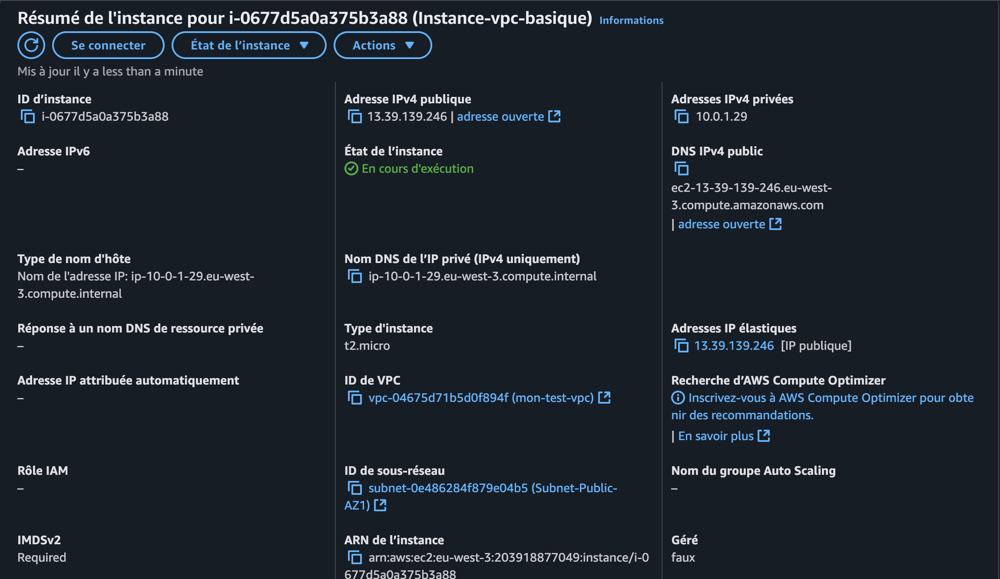
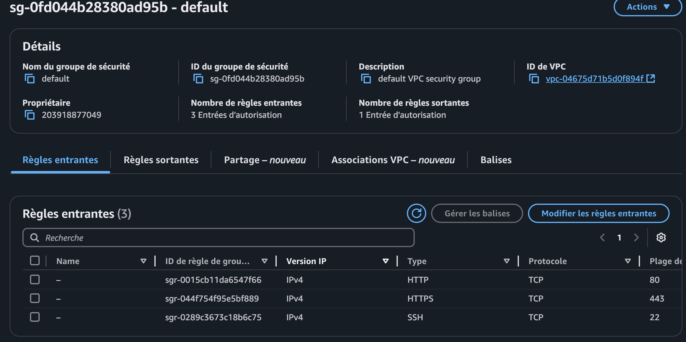
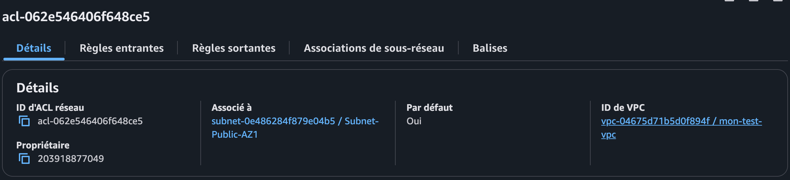

Exercice AWS : Configuration d’un VPC Basique avec EC2

Cet exercice montre comment configurer un VPC basique sur AWS avec une instance EC2 publique. Les étapes incluent la création d’un VPC, d’un sous-réseau public, d’une passerelle Internet, d’une table de routage, d’un groupe de sécurité, d’une NACL, et le lancement d’une instance EC2 avec une Elastic IP.

🎯Objectifs 

- Créer un VPC avec un CIDR (ex. 10.0.0.0/16).

- Activer la résolution DNS.

- Ajouter un sous-réseau public dans une AZ (ex. 10.0.1.0/24).

- Configurer une passerelle Internet et une table de routage.

- Lancer une instance EC2 publique avec une Elastic IP.

- Configurer un Security Group (SSH, HTTP, HTTPS).

- Configurer une NACL pour autoriser SSH, HTTP, HTTPS.

🧩 Étapes détaillées

- Création du VPC : CIDR 10.0.0.0/16, activation des DNS Hostnames.

- Sous-réseau public : CIDR 10.0.1.0/24 dans eu-west-3, auto-assignation d’IP publique activée.

- Passerelle Internet : Attachée au VPC.

- Table de routage : Route 0.0.0.0/0 vers l’IGW, associée au sous-réseau.

- Instance EC2 : Lancée dans le sous-réseau public avec une Elastic IP.

- Security Group : Règles entrantes pour SSH (22), HTTP (80), HTTPS (443).

- Network ACL : Règles entrantes/sortantes pour SSH, HTTP, HTTPS, ports éphémères (1024-65535).

Résultat
Une instance EC2 publique accessible via SSH et HTTP/HTTPS.

## Preuves
Configuration du VPC 

Sous-Réseau public 

Passerelle Internet

Table de routage 

Instance EC2

Security Group

Network ACL

